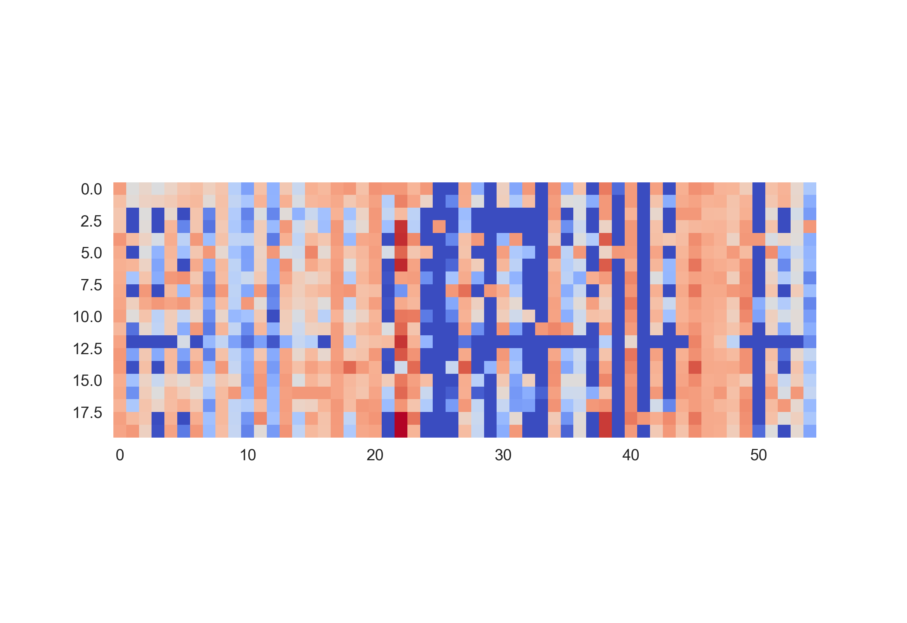
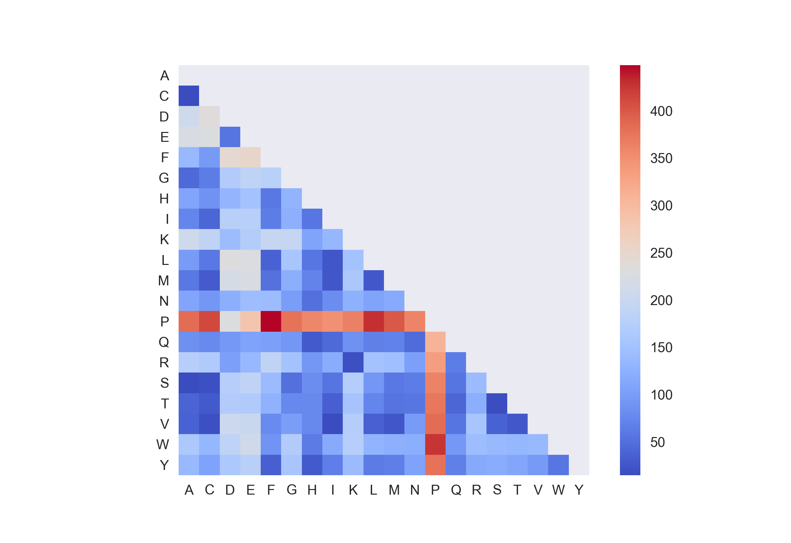

# aa-usage

Looking at data from Olson et al, epistatic 2 mutation protein scanning. From all the data, the two most similar amino acids seem to be serine and alanine. Also see that known similar amino acids like isoleucine and valine are also similar with this metric.

